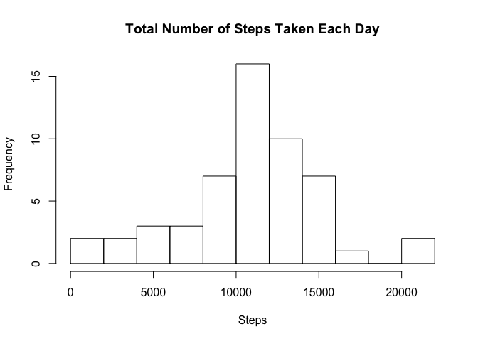
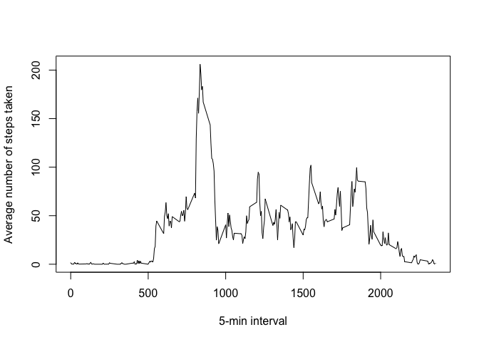
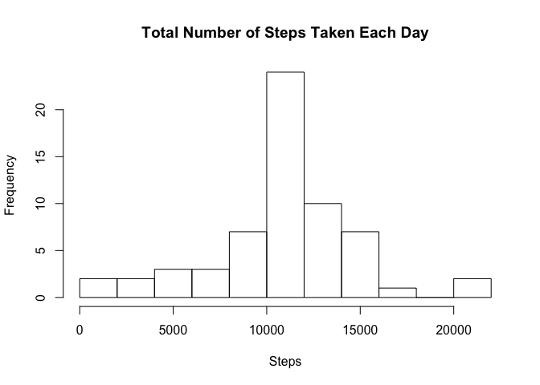

# Reproducible Research Course Project 1

###Loading the data

```r
if (!file.exists("activity.zip")) {
  fileURL <<- "https://d396qusza40orc.cloudfront.net/repdata%2Fdata%2Factivity.zip"
  download.file(fileURL, "activity.zip", method = "curl")
}
if(!file.exists("activity")) {
  unzip("activity.zip")
}

activity <<- read.csv("activity.csv", header = TRUE)
str(activity)
```

```
## 'data.frame':	17568 obs. of  3 variables:
##  $ steps   : int  NA NA NA NA NA NA NA NA NA NA ...
##  $ date    : Factor w/ 61 levels "2012-10-01","2012-10-02",..: 1 1 1 1 1 1 1 1 1 1 ...
##  $ interval: int  0 5 10 15 20 25 30 35 40 45 ...
```
###What is the mean total number of steps taken per day? 
1. Calculate the total number of steps taken per day.

```r
activitybyday <- aggregate(activity$steps, list(date=activity$date), sum)
colnames(activitybyday) <- c("date", "steps")
head(activitybyday)
```

```
##         date steps
## 1 2012-10-01    NA
## 2 2012-10-02   126
## 3 2012-10-03 11352
## 4 2012-10-04 12116
## 5 2012-10-05 13294
## 6 2012-10-06 15420
```
2. Make a histogram of the total number of steps taken each day. 

```r
hist(activitybyday$steps, main = "Total Number of Steps Taken Each Day", xlab = "Steps", breaks=10)
```




3. Calculate the mean and median of the total number of steps taken per day. 

```r
mean(activitybyday$steps, na.rm=TRUE)
```

```
## [1] 10766.19
```

```r
median(activitybyday$steps, na.rm=TRUE)
```

```
## [1] 10765
```
###What is the average daily activity pattern? 
1. Make a time series plot (i.e. type = "l") of the 5-minute interval (x-axis) and the average number of steps taken, averaged across all days (y-axis).

```r
activitybyinterval <- aggregate(activity$steps, list(interval=activity$interval), mean, na.rm=TRUE)
colnames(activitybyinterval) <- c("interval", "steps")
plot(activitybyinterval$interval, activitybyinterval$steps, type = "l", xlab = "5-min interval", ylab = "Average number of steps taken")
```




2. Which 5-minute interval, on average across all the days in the dataset, contains the maximum number of steps? 

```r
activitybyinterval[activitybyinterval$steps==max(activitybyinterval$steps), ]
```

```
##     interval    steps
## 104      835 206.1698
```
Interval 835 contains the maximum number of steps.   

###Imputing missing values
1. Calculate the total number of missing values in the dataset (i.e. the total number of rows with NAs)

```r
nrow(activity[!complete.cases(activity),])
```

```
## [1] 2304
```
2. Devise a strategy for filling in all of the missing values in the dataset.  
For the missing values in the dataset, I used the mean for that 5-minute interval.  
3. Create a new dataset that is equal to the original dataset but with the missing data filled in.

```r
meansteps <- tapply(activity$steps, activity$interval, mean, na.rm=TRUE)
activity2 <- activity
activity2$steps[is.na(activity$steps)] <- meansteps
head(activity2)
```

```
##       steps       date interval
## 1 1.7169811 2012-10-01        0
## 2 0.3396226 2012-10-01        5
## 3 0.1320755 2012-10-01       10
## 4 0.1509434 2012-10-01       15
## 5 0.0754717 2012-10-01       20
## 6 2.0943396 2012-10-01       25
```
4. Make a histogram of the total number of steps taken each day and calculate the mean and median total number of steps taken per day. Do these values differ from the estimates from the first part of the assignment? What is the impact of imputing missing data on the estimates of the total daily number of steps?  

```r
activitybyday2 <- aggregate(activity2$steps, list(date=activity2$date), sum)
colnames(activitybyday2) <- c("date", "steps")
head(activitybyday2)
```

```
##         date    steps
## 1 2012-10-01 10766.19
## 2 2012-10-02   126.00
## 3 2012-10-03 11352.00
## 4 2012-10-04 12116.00
## 5 2012-10-05 13294.00
## 6 2012-10-06 15420.00
```

```r
hist(activitybyday2$steps, main = "Total Number of Steps Taken Each Day", xlab = "Steps", breaks=10)
```



```r
mean(activitybyday2$steps)
```

```
## [1] 10766.19
```

```r
median(activitybyday2$steps)
```

```
## [1] 10766.19
```
Inputting missing data on the estimates of the total daily number of steps does not affect the mean (the mean total number of steps taken per day with missing values ignored and filled in is 10766.19); however, the median is affected (the median with missing values ignored is 10765 and the median with missing values filled in is 10766.19).  

###Are there differences in activity patterns between weekdays and weekends? 
1. Create a new factor variable in the dataset with two levels - "weekday" and "weekend" indicating whether a given date is a weekday or weekend day. 

```r
activity3 <- activity2
activity3$date <- as.Date(activity3$date)
activity3 <- transform(activity3, Dayofweek = weekdays(activity3$date))
activity3$Dayofweek <- ifelse(activity3$Dayofweek == "Saturday" | activity3$Dayofweek == "Sunday", c("weekend"), c("weekday"))
activity3$Dayofweek <- as.factor(activity3$Dayofweek)
head(activity3)
```

```
##       steps       date interval Dayofweek
## 1 1.7169811 2012-10-01        0   weekday
## 2 0.3396226 2012-10-01        5   weekday
## 3 0.1320755 2012-10-01       10   weekday
## 4 0.1509434 2012-10-01       15   weekday
## 5 0.0754717 2012-10-01       20   weekday
## 6 2.0943396 2012-10-01       25   weekday
```
2. Make a panel plot containing a time series plot (i.e. type = "l") of the 5 minute interval (x-axis) and the average number of steps taken, averaged across all weekday days or weekend days (y-axis).

```r
activitybyinterval2 <- aggregate(activity3$steps, list(interval=activity3$interval, dayofweek=activity3$Dayofweek), mean)
colnames(activitybyinterval2) <- c("interval", "dayofweek", "steps")
library(lattice)
xyplot(steps ~ interval|dayofweek, data=activitybyinterval2, type="l", layout= c(1,2))
```


